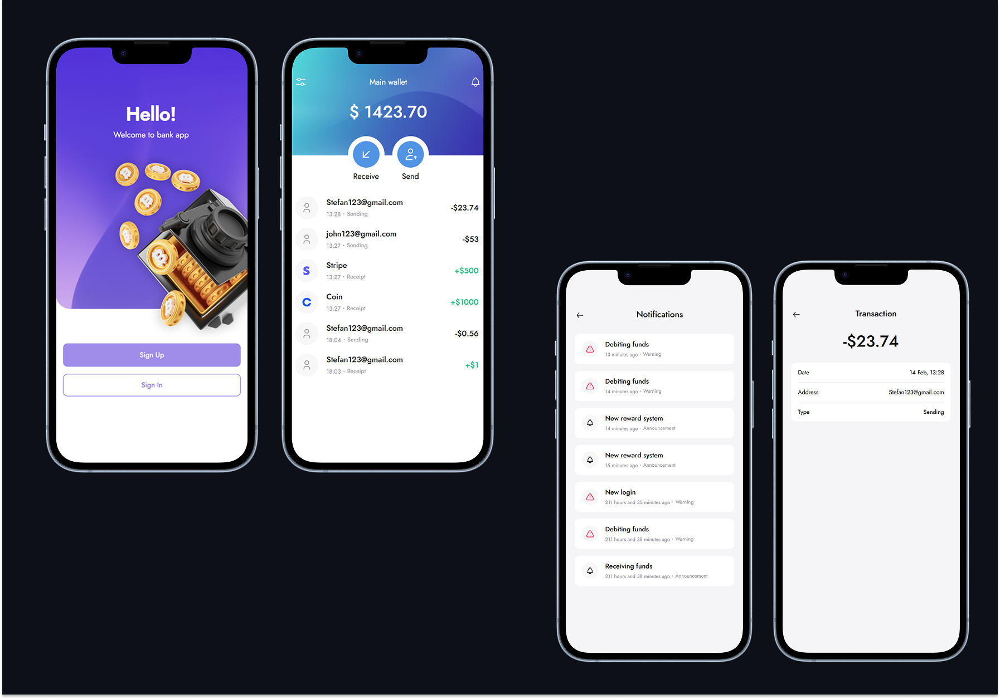

# Banking App

A secure banking application with user authentication, personal wallet management, transaction support, and notification monitoring.




## Features
- User registration and authentication
- Personal wallet management
- Transaction support and history tracking
- Notification monitoring

## Tech Stack
- **Frontend:** React, SCSS
- **Backend:** Node.js, Express

## Installation & Setup

### Backend Setup
1. Navigate to the backend folder:
   ```sh
   cd back
   ```
2. Install dependencies:
   ```sh
   npm install
   ```
3. Start the backend server:
   ```sh
   npm run dev
   ```

### Frontend Setup
1. Navigate to the frontend folder:
   ```sh
   cd front
   ```
2. Install dependencies:
   ```sh
   npm install
   ```
3. Start the frontend application:
   ```sh
   npm start
   ```

